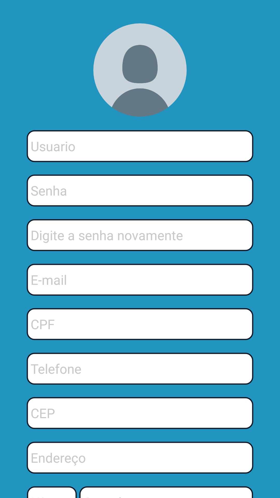

# Desafio-3-Grupo-4

# **AgroShop** 


## Integrantes 

    André Gouvea Maciel
    Antônio Rangel Chaves
    Ian Fillipe Pontes Ferreira
    Ítalo Vinícius Pereira Guimarães
    João Pedro Assunção Coutinho
    João Pedro Gomes de Almeida
    Kess Jhones Gomes Tavares
    Vitor Diniz Pagani Vieira Ribeiro

## Desafio - Cultivando Conexões

- No contexto da agricultura familiar a proposta é desenvolver uma aplicação cujo principal objetivo é estabelecer uma conexão entre os agricultores (produtores rurais) e o consumidor (a população), de forma que possa acontecer a listagem, a comercialização e a distribuição de produtos agrícolas entre as partes mencionadas.

## Solução da equipe para o desafio

- Nós em grupo decidimos criar um aplicativo para android usando React-Native, uma biblioteca do JavaSript, e o banco de dados Firebase.
- Idealizamos criar um aplicativo de vendas de produtos agrícolas, na qual uma pessoa poderia tanto compra como vender seus produtos, ao realizar uma compra, o vendedor receberia os dados do comprador e marcariam via e-mail ou telefone, a melhor maneira de finalizar a compra, logo, detalhes de entrega e pagamento ficaria por conta do contato entre eles.


## Para configurar o ambiente

```
    sudo apt install build-essential default-jdk nodejs npm git

    sudo npm install -g expo-cli

    sudo npm install -g yarn
        
    sudo npm install -g n

    sudo n stable

    reset
```

## Para rodar o app

* **Instalar app do expo no celular**

    Dentro da pasta Desafio-3-Grupo-4 rodar os comandos:

        1. yarn install
    
        2. yarn start


Tela inicial | Tela de login | Tela de cadastro
--------- | ------ | ------
 |  | 

Tela de pesquisa | Tela da categoria | Tela do produto
--------- | ------ | ------
 |  | 

Tela da cesta | Tela do perfil público | Tela do perfil privado | Tela de adicionar e excluir produto
--------- | ------ | ------ | ------
 |  |  |  | 

Tela de cadastrar produto | Tela dos pedidos feitos | Tela dos pedidos recebidos | Tela da descrição do pedido
--------- | ------ | ------ | ------
 |  |  |  


# Funções:

- [x] Cadastro sendo enviado para o banco de dados
- [x] Cadastro do produto sendo enviado para o banco de dados
- [x] Aplicativo recebendo dados do banco, nas telas:
    - tela inicial
    - tela da categoria
    - tela do produto
    - tela da cesta

- [ ] Implementar esqueci minha senha
- [ ] Verificação do login
- [ ] Editar perfil
- [ ] Upload da imagem para o banco de dados


